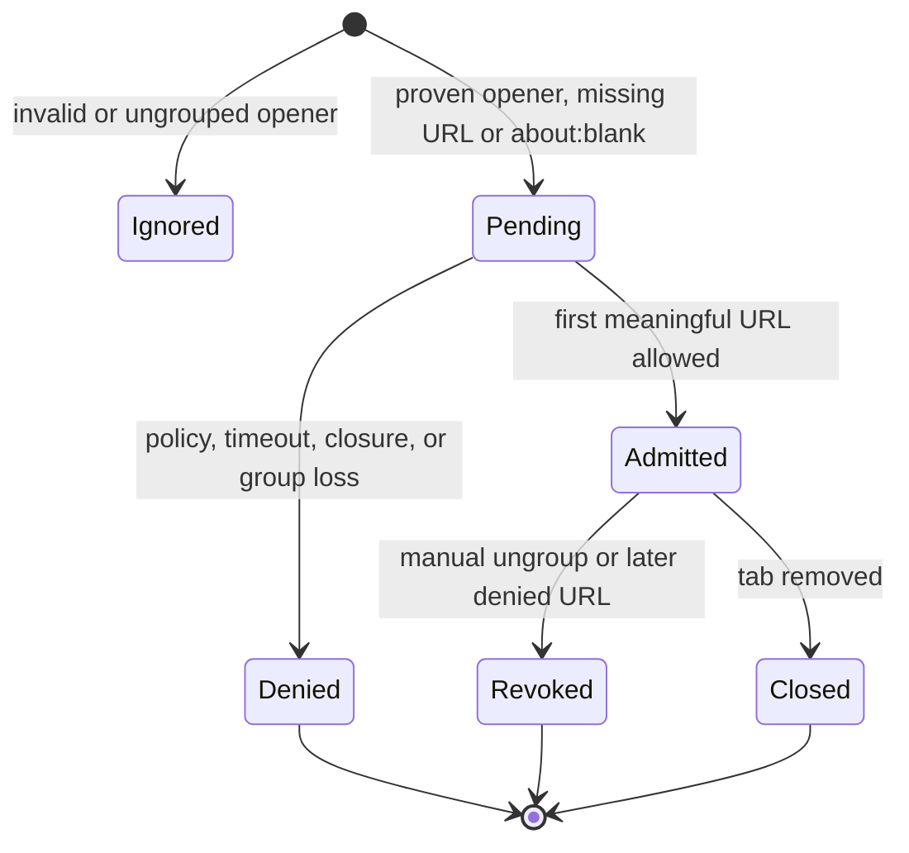

# Descendant popup containment

Descendant popup containment lets a site-created child inherit control only from the exact
grouped opener that created it. It is a creation-time authority transfer, not a URL or window
heuristic.

## State model

At `chrome.tabs.onCreated`, the handler requires distinct integer child and opener IDs. It
reads the opener and captures the exact OpenClaw group ID before grouping can clear
`openerTabId`. Missing, null, same-as-child, inaccessible, wrong-title, or ungrouped openers
produce no pending authority.

A child without a meaningful URL stores only bounded ancestry facts. It is absent from relay
inventory and cannot be attached. The first meaningful pending or committed URL is evaluated
by [[concepts/navigation-hostname-policy]]. Only after admission may grouping reuse the exact
opener group and inventory synchronize.

Grouping failure, closure, timeout, policy denial, opener revocation, or connection replacement
clears pending state. Later denial retires the current access epoch before asynchronous reads
or further CDP forwarding. Manual ungrouping is permanent for that creation event because the
extension never re-runs inheritance for an existing tab.

Ticket 04 integrated the extension module and real Chromium coverage for normal and popup
children. Ticket 05 still owns composition with root creation, direct relay policy, stable task
handles, and descendant-before-root cleanup.

## Sources

- [[sources/artifact-ticket-personal-chrome-browser-control-02]]
- [[sources/artifact-ticket-personal-chrome-browser-control-04]]
- [[sources/artifact-ticket-personal-chrome-browser-control-05]]
