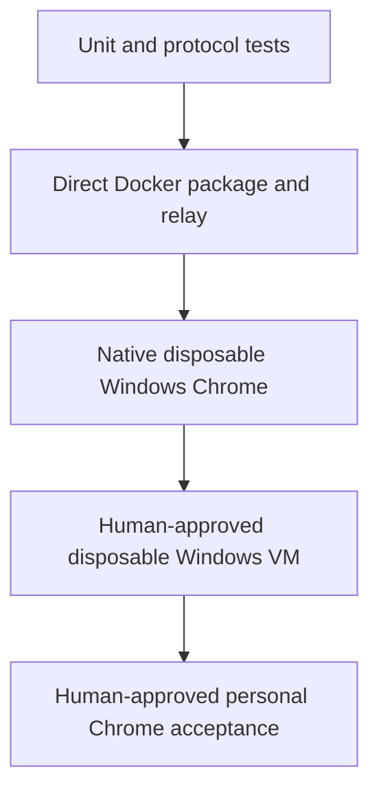

# Evidence lanes

The project assigns each behavioral claim to the cheapest environment that can actually
observe it. A green lane does not inherit the capabilities of the lane above it.

## Claim ladder

Unit and protocol tests own deterministic matcher, state-machine, failure, and cleanup logic.
They are fast and causally precise, but Chrome behavior remains mocked.

The Docker lane builds the supported package and runs an isolated Gateway and synthetic relay
peer. It proves package contents, config parsing, protocol negotiation, direct CDP policy,
typed errors, and task-owned cleanup in Linux. The actual Ticket 01 verification used direct
Docker build/run with read-only mounts; it did not use Docker Compose. Docker cannot establish
MV3 worker behavior, Windows profile selection, Chrome grouping, interactive desktop startup,
or DPAPI-bound session state.

Native disposable Windows Chrome loads only the candidate unpacked extension into a temporary
Chrome for Testing profile. It proves real tab and popup events, exact group movement,
extension pairing, launch/readiness, reconnect, renderer replacement, revoke, and physical
cleanup without touching personal Chrome. Ticket 04's real-Chromium proof belongs here.

The disposable Windows VM owns restart-sensitive behavior: interactive logon, Gateway and
Chrome restart, extension-worker restart, RDP transitions where supported, and Windows reboot.
Provisioning changes the host and therefore requires action-time human approval.

Personal-profile acceptance is last. It alone can prove the final candidate against the
authorized signed-in profile and live OpenClaw composition. Its mutation surface, backup,
rollback, harmless destinations, and exact created tab IDs must be approved immediately before
the run.

## Why the separation matters

A lower lane can expose a defect that blocks higher work, but it cannot certify higher
environment behavior. This keeps claims honest and prevents resource pressure from turning
Docker into a false substitute for Windows or personal Chrome. The current completion state is
tracked in [[synthesis/implementation-frontier]].

## Sources

- [[sources/artifact-ticket-personal-chrome-browser-control-01]]
- [[sources/artifact-ticket-personal-chrome-browser-control-06]]
- [[sources/artifact-ticket-personal-chrome-browser-control-07]]
- [[sources/artifact-ticket-personal-chrome-browser-control-08]]
- [[sources/artifact-wayfinder-personal-chrome-browser-control]]
