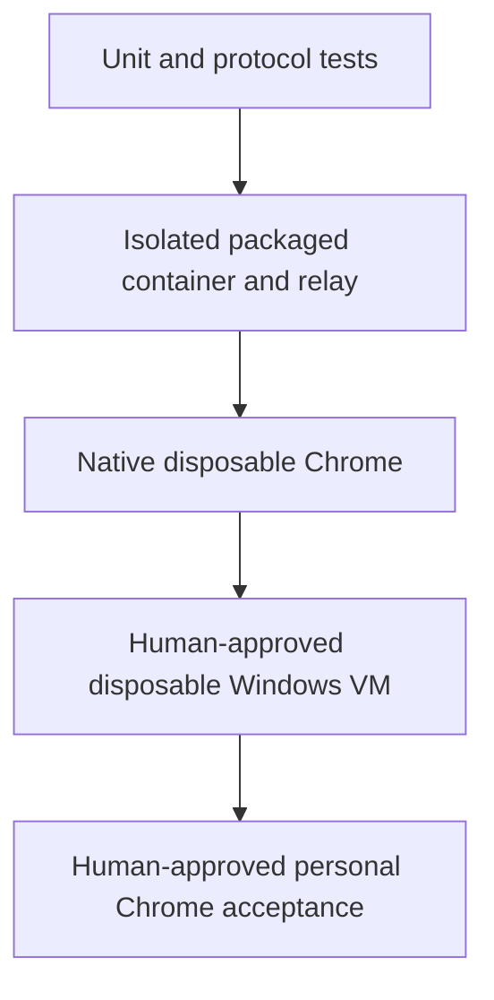

# Evidence lanes

The project assigns each behavioral claim to the cheapest environment that can actually
observe it. A green lane does not inherit the capabilities of the lane above it.

## Claim ladder

Unit and protocol tests own deterministic matcher, state-machine, failure, and cleanup logic.
They are fast and causally precise, but Chrome behavior remains mocked.

The isolated container lane builds the supported package and runs an isolated Gateway and
synthetic relay peer. It proves package contents, config parsing, protocol negotiation, direct
CDP policy, typed errors, and task-owned cleanup in Linux. Ticket 01 historically used direct
Docker build/run. The current Ticket 06 proof used native Apple `container`, Linux ARM64,
16 GB RAM, 8 CPUs, read-only mounts, and no network. Neither container runtime can establish
MV3 worker behavior, interactive desktop startup, or host-bound session state.

Native disposable Chrome loads only the candidate unpacked extension into a temporary Chrome
for Testing profile. It can prove real tab and popup events, exact group movement, extension
pairing, launch/readiness, reconnect, renderer replacement, revoke, and physical cleanup
without touching personal Chrome. Ticket 06 passed its local native Chromium scenarios, while
the separate packaged Windows probe remains incomplete because Chrome intermittently lost the
debugger attachment.

The disposable Windows VM owns restart-sensitive behavior: interactive logon, Gateway and
Chrome restart, extension-worker restart, RDP transitions where supported, and Windows reboot.
Provisioning changes the host and therefore requires action-time human approval.

Personal-profile acceptance is last. It alone can prove the final candidate against the
authorized signed-in profile and live OpenClaw composition. Its mutation surface, backup,
rollback, harmless destinations, and exact created tab IDs must be approved immediately before
the run.

## Why the separation matters

A lower lane can expose a defect that blocks higher work, but it cannot certify higher
environment behavior. This keeps claims honest and prevents a passing 16 GB container run from
being treated as restart or personal-profile evidence. The current completion state is tracked
in [[synthesis/implementation-frontier]] and
[[sources/ticket-autopilot-personal-chrome-afk-05-06-main-v1-status]].

## Sources

- [[sources/artifact-ticket-personal-chrome-browser-control-01]]
- [[sources/artifact-ticket-personal-chrome-browser-control-06]]
- [[sources/artifact-ticket-personal-chrome-browser-control-07]]
- [[sources/artifact-ticket-personal-chrome-browser-control-08]]
- [[sources/artifact-wayfinder-personal-chrome-browser-control]]
- [[sources/ticket-autopilot-personal-chrome-afk-05-06-main-v1-status]]
