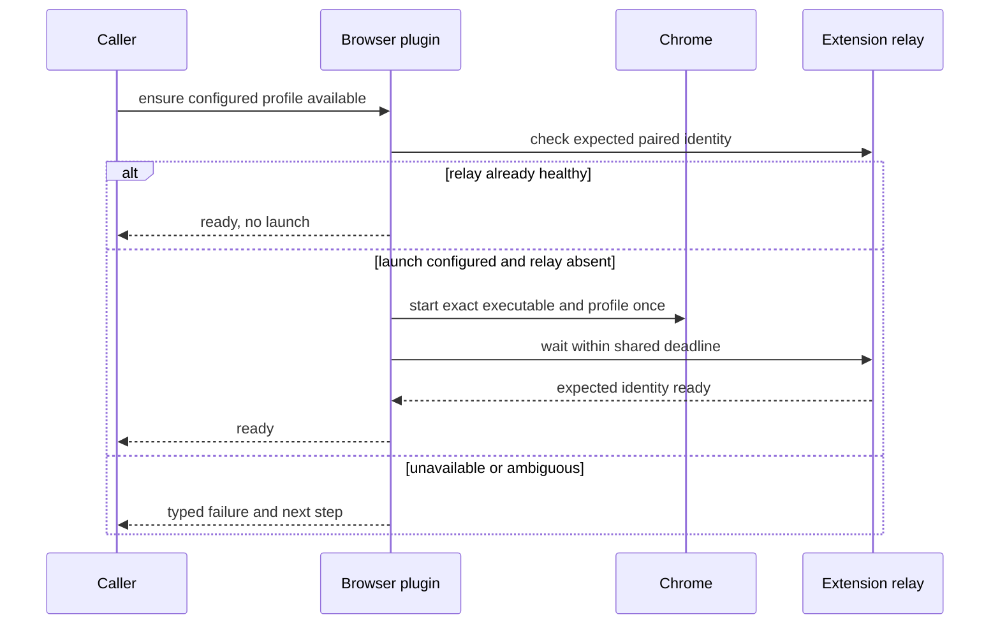

# Extension profile readiness

Extension profile readiness is the browser-plugin-owned path that reaches one explicitly
configured Chrome profile and verifies its expected OpenClaw extension relay. It does not make
the extension profile a managed-CDP profile.

## Configuration identity

The profile identifies an executable, Chrome user-data directory, and Chrome profile-directory
name. An account address is neither configuration identity nor a launch argument. Cookies,
passwords, tokens, and pairing secrets remain in their owning stores and are never copied into
source or diagnostics.

## Readiness sequence

Concurrent calls coalesce around one launch/readiness operation. The owner makes at most one
launch attempt under one bounded deadline. A second Chrome process, a fallback to another
profile, or a broad kill-and-retry sequence would violate both privacy and lifecycle ownership.

## Failure contract

Wrong profile, missing configuration, missing extension, unpaired relay, launch failure,
ambiguity, timeout, and cancellation remain distinct redacted results. On Windows, desktop
Chrome requires an interactive user session; service or reboot behavior belongs to the VM
lane, not this readiness claim.

Ticket 03 is integrated. Ticket 05 must compose readiness with transactional root authority;
the launcher alone does not prove tab creation, popup containment, policy, or cleanup.

## Sources

- [[sources/artifact-wayfinder-personal-chrome-browser-control]]
- [[sources/artifact-ticket-personal-chrome-browser-control-03]]
