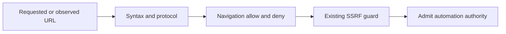

# Navigation hostname policy

Navigation hostname policy is an optional profile-scoped admission rule for destinations the
browser automation may control. It is deliberately separate from SSRF exceptions.

## Semantics

`allowHostnames` is exclusive only when non-empty. `denyHostnames` always wins. Exact entries
match one normalized hostname; `*.example.com` matches proper subdomains but not the bare
suffix. Matching ignores URL ports and uses lowercased, IDNA-normalized hostnames without a
final DNS dot. Embedded credentials, malformed URLs, unsupported schemes, and invalid patterns
fail closed.

An absent policy or empty allow list preserves otherwise-safe public HTTP(S) browsing. It does
not weaken SSRF checks. Conversely, `ssrfPolicy.allowedHostnames` remains a private-network
trust exception and never grants navigation admission.

## One compiled policy

The browser plugin compiles config once into a bounded deterministic versioned value. Node and
the unpacked MV3 extension execute the same pure matcher source. After relay authentication,
the Gateway installs the compiled policy with a connection nonce before accepting the first
inventory-bearing hello. Disconnect or replacement clears extension policy state; no policy
copy is written to extension storage.

This design prevents Gateway and extension normalization from drifting and keeps policy bound
to the exact authenticated socket. A legacy extension is acceptable only for an empty policy;
a configured policy requires the capable handshake and otherwise returns a visible update or
reload instruction.

## Enforcement neighborhood

The decision covers root creation, direct authenticated relay create or navigate commands,
normal navigation, every observable redirect and final URL, popup pending admission, later URL
changes, inventory publication, debugger attachment, and subsequent command forwarding.
Extension URL-change handling retires authority before awaited inspection so a denied page
cannot continue emitting controlled CDP traffic.

Ticket 02 accepted the design. Ticket 04 consumes its pending-child model, while Ticket 05 owns
the complete runtime integration.

## Sources

- [[sources/path-docs-adrs-2026-08-27-browser-navigation-hostname-policy-md]]
- [[sources/artifact-ticket-personal-chrome-browser-control-02]]
- [[sources/artifact-ticket-personal-chrome-browser-control-05]]
