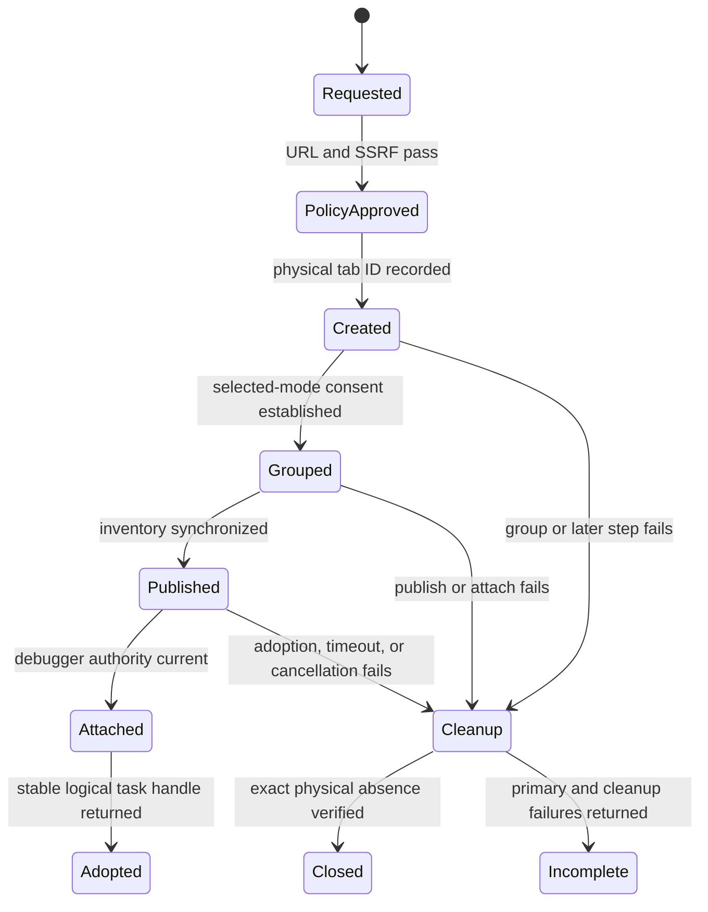

# Task-owned browser authority

Task-owned browser authority is the exact, revocable relationship between one admitted task
and the physical Chrome tabs it created or legitimately inherited. A URL, active tab, window,
or managed-inventory entry is never enough to establish ownership.

## Transactional root flow

Physical provenance must exist before a tab enters managed inventory and remain available
until adoption or verified cleanup. Otherwise a timeout can erase the only reference to an
orphan. Cleanup closes admitted descendants before their root and matches exact physical IDs;
it never searches by URL.

## Revocation and continuity

The stable logical handle may follow renderer replacement or relay reconnect only while the
same physical tab generation remains authorized. Manual ungrouping, tab removal, a different
extension connection, policy denial, access-epoch loss, or lifecycle replacement invalidates
the captured authority. Every asynchronous boundary must revalidate the current owner before
forwarding another CDP event or recording success.

The [[entities/openclaw-chrome-extension|OpenClaw Chrome extension]] uses the tab group as the
operator-visible consent boundary. It is necessary but not sufficient: code also needs current
extension connection identity, access epoch, physical tab generation, policy admission, and
task provenance. This prevents a newly reused target ID or an unrelated grouped tab from
inheriting stale authority.

## Product result

Every requested action ends in one of three observable classes: success with a stable task
handle, a typed boundary or policy failure with the next safe step, or a primary failure plus
an explicit incomplete-cleanup outcome. Silent disappearance is not acceptable.

Ticket 04 supplied creation-time descendant containment. Ticket 05 integrated root creation,
direct relay commands, navigation, lifecycle, revocation, and exact cleanup. Ticket 06 is now
testing that owner boundary as a frozen packaged flow; its remaining debugger-detach defect
does not transfer ownership to a downstream workaround
[[sources/ticket-autopilot-personal-chrome-afk-05-06-main-v1-status]]. See
[[concepts/descendant-popup-containment]] and [[synthesis/implementation-frontier]].

## Sources

- [[sources/artifact-wayfinder-personal-chrome-browser-control]]
- [[sources/artifact-ticket-personal-chrome-browser-control-04]]
- [[sources/artifact-ticket-personal-chrome-browser-control-05]]
- [[sources/ticket-autopilot-personal-chrome-afk-05-06-main-v1-status]]
