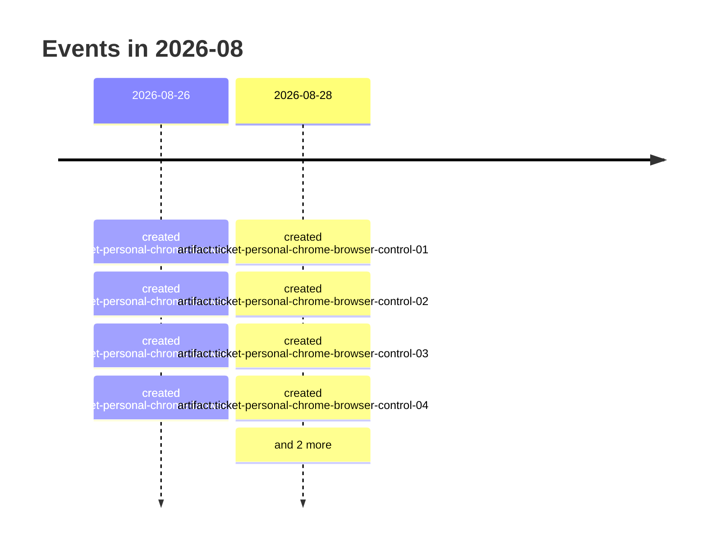

# 2026-08

10 dated event(s). Every date carries the rung that produced it; a date
the resolver could not establish is absent from this page rather than guessed onto it.

## Events

- `2026-08-26` — created of Enforce task-owned lifecycle and domain policy (`artifact:ticket-personal-chrome-browser-control-05`), from a filesystem timestamp *(low confidence)*
- `2026-08-26` — created of Prove the packaged flow in isolation (`artifact:ticket-personal-chrome-browser-control-06`), from a filesystem timestamp *(low confidence)*
- `2026-08-26` — created of Provision the Windows restart lane (`artifact:ticket-personal-chrome-browser-control-07`), from a filesystem timestamp *(low confidence)*
- `2026-08-26` — created of Accept the candidate on personal Chrome (`artifact:ticket-personal-chrome-browser-control-08`), from a filesystem timestamp *(low confidence)*
- `2026-08-28` — created of Build the conflict-free isolation harness (`artifact:ticket-personal-chrome-browser-control-01`), from a filesystem timestamp *(low confidence)*
- `2026-08-28` — created of Decide the browser domain-policy seam (`artifact:ticket-personal-chrome-browser-control-02`), from a filesystem timestamp *(low confidence)*
- `2026-08-28` — created of Implement extension-profile launch and readiness (`artifact:ticket-personal-chrome-browser-control-03`), from a filesystem timestamp *(low confidence)*
- `2026-08-28` — created of Implement descendant popup containment (`artifact:ticket-personal-chrome-browser-control-04`), from a filesystem timestamp *(low confidence)*
- `2026-08-28` — created of Personal Chrome browser control (`artifact:wayfinder-personal-chrome-browser-control`), from a filesystem timestamp *(low confidence)*
- `2026-08-28` — created of Browser navigation hostname policy (`path:docs/adrs/2026-08-27-browser-navigation-hostname-policy.md`), from a commit touching the file
